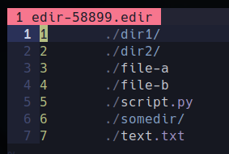

# ARCHIVED

> [!WARNING]
> This repo is not maintained anymore.
> For the latest and improved edir syntax files, we recommend checking out [denilsonsa/vim-edir-syntax](https://github.com/denilsonsa/vim-edir-syntax). 


----
<br><br><br><br>
----

# edir Color Highlighting for Vim

[edir](https://github.com/bulletmark/edir) color highlighting for vim to easily recognize directory and file extensions

## Screenshot



## Installation

1. Move `edir.vim` to your vim syntax folder (usually `~/.vim/syntax/`)
2. Add this into your vim config
```vim
augroup filetypedetect
    au! BufRead,BufNewFile *.edir set filetype=edir
augroup END
```
3. run edir with suffix `.edir`
```console
$ edir --suffix .edir
```
